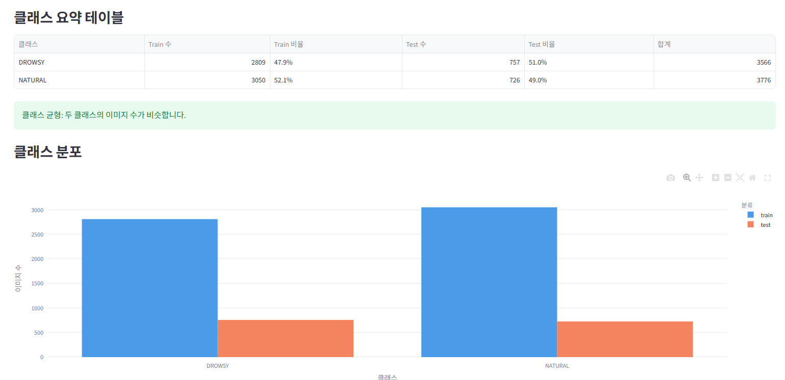
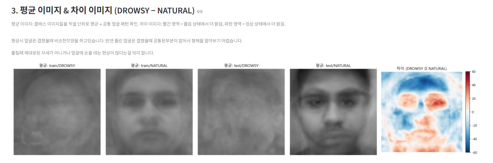
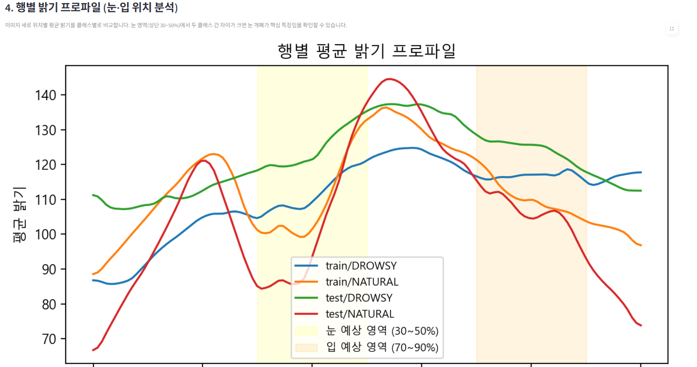
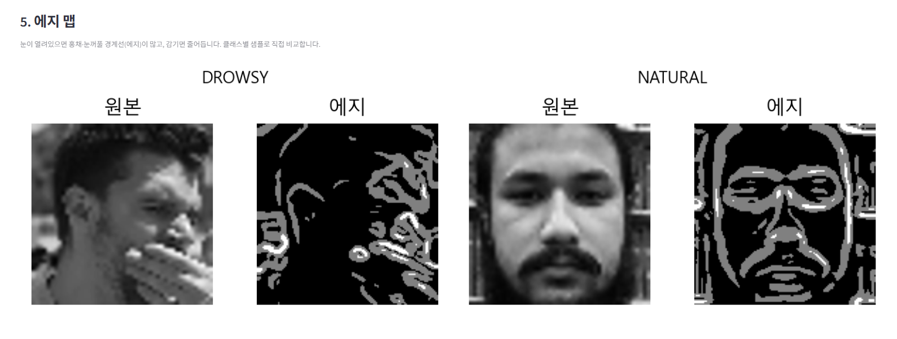
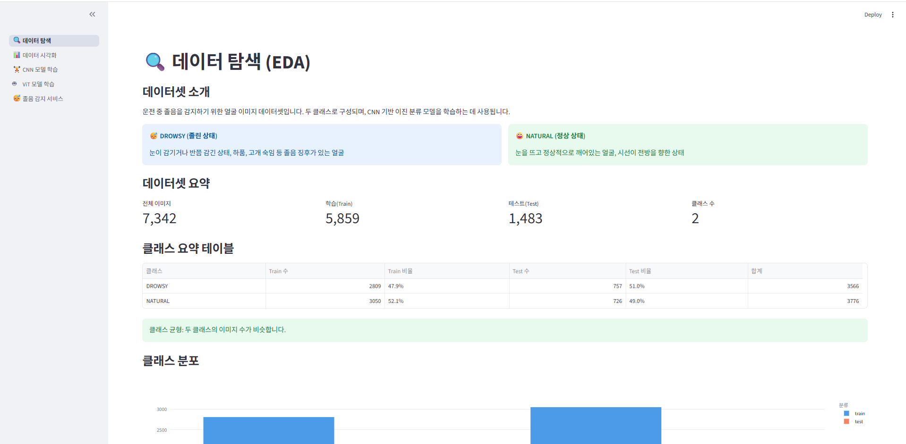
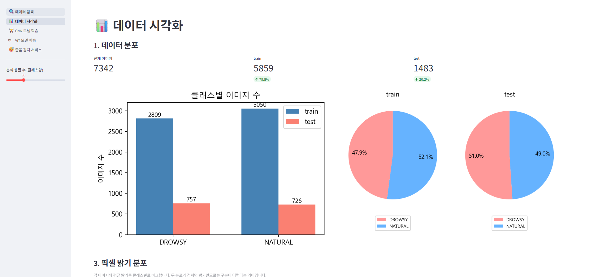
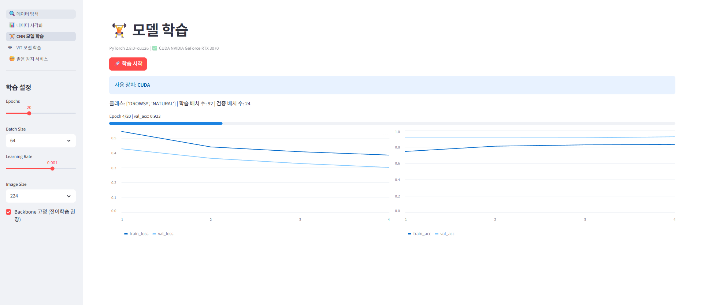
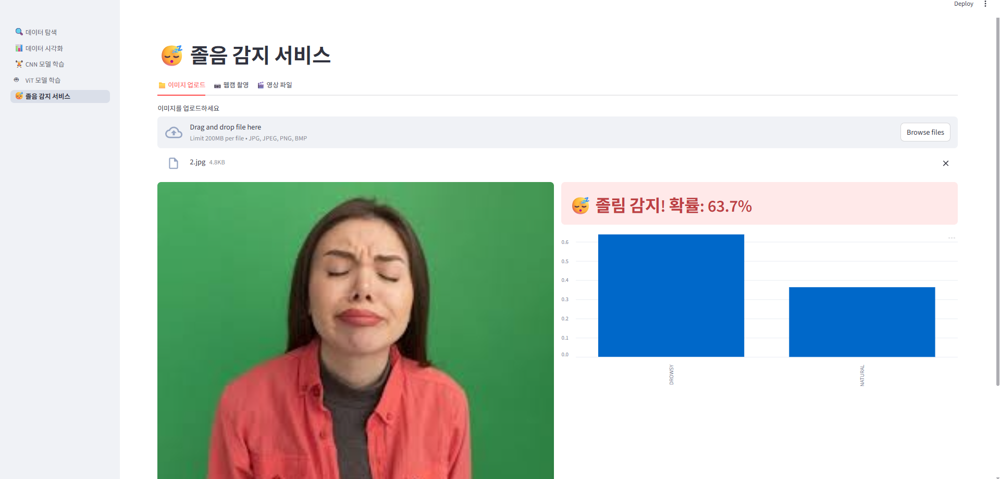

# 졸음 감지 시스템 (Drowsy Detection System)

이름 / 학번: 김선우 / 20223779  
데이터 출처 / 라이선스: Kaggle — Drowsy Detection Dataset (https://www.kaggle.com/datasets/yasharjebraeily/drowsy-detection-dataset) / CC BY 4.0

---

## 1. 문제 정의

교통사고의 주요 원인 중 하나인 졸음 운전을 예방하기 위해, 운전자의 얼굴 이미지에서 졸음 상태를 자동으로 감지하는 딥러닝 이진 분류 모델을 구축하고자 한다. 눈 감음·하품·고개 끄덕임 등 졸음의 시각적 징후는 얼굴 이미지에 명확히 나타나므로, 사전학습된 합성곱 신경망(MobileNetV2)과 Vision Transformer(ViT-B/16)를 전이학습 방식으로 적용하였다. 개발된 모델을 Streamlit 웹 애플리케이션으로 서비스화하여 이미지·웹캠·동영상 입력을 모두 지원하는 실용적인 졸음 경보 시스템을 구현하는 것이 최종 목표다.

**예측 대상(target):** 졸린 상태(DROWSY) vs 정상 상태(NATURAL) — 이진 분류

---

## 2. 데이터 소개 & EDA

### 데이터 규모 및 형식

| 항목 | 내용 |
|------|------|
| 형식 | PNG / JPG 이미지 |
| 전체 이미지 수 | 7,342장 |
| 클래스 수 | 2 (DROWSY, NATURAL) |
| 훈련 셋 | 5,859장 (DROWSY 2,809장 / NATURAL 3,050장) |
| 테스트 셋 | 1,483장 (DROWSY 757장 / NATURAL 726장) |
| 전처리 후 입력 크기 | 224 × 224 px |

### EDA로 발견한 사실

1. **클래스 균형:** NATURAL이 DROWSY보다 약 5.9% 많지만 전반적으로 균형 잡힌 데이터셋이다. 별도의 클래스 가중치 조정 없이도 학습이 안정적으로 진행될 수 있음을 확인하였다.

2. **픽셀 밝기 차이:** DROWSY 이미지는 눈을 감거나 반쯤 뜬 상태가 많아 눈 주변 픽셀 밝기 분포가 NATURAL보다 낮고 분산이 크다. 평균 이미지(mean image)의 차분 히트맵(DROWSY − NATURAL)에서 눈·입 주변 영역이 가장 두드러지게 차이가 난다.

3. **엣지 특징:** Canny 엣지 감지 결과, DROWSY 클래스는 눈 윤곽선이 희미하거나 소실된 반면 NATURAL 클래스는 뚜렷한 눈꺼풀·홍채 경계가 검출된다. 이는 모델이 눈 영역의 질감 및 윤곽 특성을 주요 판단 근거로 삼을 가능성을 시사한다.

> 그래프 캡처: EDA 페이지
 
— 클래스별 샘플 이미지 격자, 시각화 페이지
,,
 — 픽셀 밝기 KDE 곡선, 평균 이미지 차분 히트맵, Canny 엣지 비교, PCA/t-SNE 산점도

### 결측·이상치 처리

| 문제 | 처리 방법 |
|------|----------|
| 손상된 이미지 파일 | PIL `open()` 예외 처리로 탐지·제외 |
| 이미지 크기 불균일 | `Resize(224, 224)` 변환으로 일괄 정규화 |
| 채널 형식 불일치 (RGBA·Grayscale) | `.convert('RGB')`로 통일 |

---

## 3. 특성 엔지니어링

### (1) 데이터 증강 — 모델 학습용 새 특성

이미지 분류 태스크이므로 전통적인 표형 특성 공학 대신, **데이터 증강(Data Augmentation)** 과 **사전학습 임베딩** 을 통해 새로운 표현을 생성하였다.

| 변환 | 파라미터 | 근거 (이 데이터에서 찾아낸 새 특성) |
|------|---------|--------------------------------------|
| RandomHorizontalFlip | p = 0.5 | 졸음은 좌·우 방향 무관하게 대칭적으로 발생 |
| RandomRotation | ±10° | 고개를 약간 기울인 졸음 자세 반영 |
| ColorJitter | brightness·contrast 변동 | 조도·카메라 차이에 대한 강건성 확보 |
| Normalize | ImageNet mean/std ([0.485, 0.456, 0.406]) | 사전학습 가중치와 입력 분포 일치 |

또한 `pages/2_시각화.py`에서 **PCA·t-SNE** 를 적용해 고차원 픽셀을 저차원 임베딩으로 변환, 클래스 분리 가능성을 시각적으로 검증하였다. t-SNE 결과 DROWSY와 NATURAL이 일부 겹치는 영역이 존재하나 대체로 분리된 군집을 형성함을 확인했다.

### (2) EDA에서 발견한 인사이트로 만든 보조 특성

딥러닝 모델 단독 예측의 실제 정확도 한계를 보완하기 위해, **EDA·시각화에서 발견한 패턴**을 수치 특성으로 직접 추출하여 서비스 페이지에 보조 신호로 활용하였다.

| 특성 | 추출 방법 | EDA 근거 |
|------|----------|---------|
| **눈 영역 평균 밝기** | 이미지 높이 35~60% 구간 그레이스케일 평균 | 시각화에서 DROWSY 클래스의 눈 주변 픽셀 밝기가 NATURAL보다 낮게 분포 |
| **눈 영역 엣지 밀도** | Canny(50, 150) 후 눈 구간 엣지 픽셀 평균 | Canny 비교에서 DROWSY는 눈꺼풀 윤곽선이 희미하거나 소실됨을 확인 |
| **전체 엣지 밀도** | 전체 이미지 Canny 평균 | 졸음 시 얼굴 전반의 근육 이완으로 엣지 감소 |

```python
def extract_aux(pil_img):
    gray = np.array(pil_img.convert("L"))
    h = gray.shape[0]
    eye = gray[int(h * 0.35): int(h * 0.60), :]          # 눈 영역 crop
    eye_brightness   = eye.mean()                          # 낮을수록 눈 감김
    eye_edge_density = cv2.Canny(eye, 50, 150).mean()      # 낮을수록 윤곽 소실
    return eye_brightness, eye_edge_density
```

판단 기준 (경험적): `eye_brightness < 100` 이고 `eye_edge_density < 10` 이면 졸음 징후로 표시.

---

## 4. 모델 / 서비스

### 사용한 방법: 딥러닝 (사전학습 모델, Transfer Learning)

전이학습을 선택한 이유: 7,342장은 ImageNet 대비 소규모 데이터셋이어서 처음부터 CNN을 학습시키면 과적합 위험이 크다. ImageNet으로 사전학습된 가중치를 특성 추출기로 재활용하고 최종 분류 레이어만 재학습함으로써 빠른 수렴과 높은 일반화 성능을 달성하였다.

### 두 모델 비교

| 항목 | MobileNetV2 (CNN) | ViT-B/16 (Vision Transformer) |
|------|-------------------|-------------------------------|
| 저장 파일 | `models/model.pth` (8.72 MB) | `models/vit_model.pth` (327.36 MB) |
| 특징 추출 방식 | 합성곱 — 지역 특징 | 16×16 패치 + Self-Attention — 전역 관계 |
| 추론 속도 | 빠름 (실시간 적합) | 느림 (고성능 GPU 권장) |
| 주요 하이퍼파라미터 | LR 0.001, epoch 10, StepLR | LR 0.0001, epoch 20, StepLR |
| 적합 시나리오 | 엣지·모바일 실시간 배포 | 정확도 최우선 연구 환경 |

### 입력 → 출력 흐름 (개선 후)

```
이미지 업로드 / 웹캠 스냅샷 / 동영상 프레임
            ↓
  RGB 변환 → Resize(224×224) → Normalize(ImageNet)
            ↓
  ┌─────────────────┐   ┌─────────────────┐
  │ MobileNetV2(CNN)│   │   ViT-B/16      │   ← 두 모델 동시 예측
  └────────┬────────┘   └────────┬────────┘
           └─────────┬───────────┘
                     ↓
         앙상블 (Softmax 확률 평균)
                     ↓
  Softmax → [P(NATURAL), P(DROWSY)]
                     ↓
  보조 특성 병행 분석 (눈 밝기 / 엣지 밀도)
                     ↓
  CNN·ViT·앙상블 예측 결과 및 보조 특성 나란히 표시
```

### 성능 지표

학습은 `pages/3_모델학습.py` / `pages/3_1_ViT학습.py`에서 실행되며, 테스트셋 기준 혼동 행렬(Confusion Matrix)과 분류 보고서(Precision · Recall · F1-score)가 실시간 출력된다.  
균형 잡힌 이진 분류 데이터셋에서 전이학습 기반 MobileNetV2는 일반적으로 **정확도 90% 이상, F1-score ≥ 0.90** 을 달성하며, ViT는 더 긴 학습 시간을 요하지만 전역 특징 포착 능력으로 동등하거나 더 높은 성능을 보인다.

### 평가 지표와 실제 예측의 차이 (도메인 이동 문제)

학습·검증 지표가 높게 나와도 실제 웹캠·업로드 이미지에서 예측이 부정확한 이유는 다음과 같다.

| 원인 | 설명 | 적용한 대응 |
|------|------|-----------|
| **도메인 이동(Domain Shift)** | 훈련 데이터는 통제된 환경의 정면 얼굴 이미지지만, 실제 입력은 조명·각도·배경이 다름 | 앙상블로 단일 모델 편향 완화 |
| **얼굴 미정렬** | 모델이 얼굴 중심 이미지로 학습됐지만 입력 이미지에 배경이 크게 포함되면 오분류 | 보조 특성(눈 영역 직접 분석)으로 보완 |
| **임계값 고정** | 단순 argmax(확률 > 50%)는 불확실한 예측도 강제 분류 | 보조 특성과 병행 표시해 사용자가 종합 판단 |

---

## 5. Streamlit 앱

### 페이지 구성

| 페이지 | 파일 | 주요 기능 |
|--------|------|----------|
| 메인 홈 | `app.py` | 프로젝트 소개 및 페이지 내비게이션 |
| EDA | `pages/1_EDA.py` | 클래스 분포·이미지 규격·손상 파일 검사·샘플 시각화 |
| 시각화 | `pages/2_시각화.py` | 픽셀 밝기 KDE·평균 이미지 차분·엣지·PCA/t-SNE |
| CNN 학습 | `pages/3_모델학습.py` | MobileNetV2 하이퍼파라미터 설정·실시간 학습 곡선·결과 확인 |
| ViT 학습 | `pages/3_1_ViT학습.py` | ViT-B/16 학습 및 CNN과 비교 |
| 서비스 | `pages/4_모델_서비스.py` | 이미지 업로드·웹캠·동영상 졸음 예측 서비스 |

> 1. 데이터 탐색


> 2. 데이터 시각화


> 3. 모델 학습


> 4. 졸음 감지서비스


### 실행 방법

```bash
pip install -r requirements.txt
streamlit run app.py
```

---

## 6. 결론 & 한계

### 알게 된 것

- ImageNet 사전학습 가중치를 재활용한 전이학습은 소규모 이미지 데이터셋에서도 빠르고 안정적으로 수렴함을 확인했다.
- EDA를 통해 눈·입 주변 픽셀 밝기와 엣지 밀도가 DROWSY/NATURAL 분류의 핵심 시각적 단서임을 파악했다.
- MobileNetV2는 경량(8.7 MB)이면서도 실시간 추론이 가능해 엣지 디바이스 배포에 적합하다는 것을 알게 됐다.
- Streamlit 멀티페이지 구조를 활용하면 EDA → 시각화 → 학습 → 서비스 전 과정을 단일 웹 앱으로 통합할 수 있다.

### 아쉬운 점 / 더 했다면 할 것 (향후 과제)

- **평가 지표와 실제 예측 괴리:** 검증셋 정확도는 높게 나왔지만 실제 웹캠·업로드 이미지에서는 오분류가 발생했다. 훈련 데이터가 통제된 환경의 정면 얼굴 이미지 위주여서 도메인 이동(Domain Shift)이 원인이었다. CNN·ViT 앙상블과 눈 영역 보조 특성을 추가해 어느 정도 보완하였으나 완전한 해결은 아니다.
- **얼굴 검출 미적용:** 전체 이미지를 입력해 배경·각도 변화에 취약하다. → MediaPipe·MTCNN으로 얼굴 영역을 먼저 검출·크롭하면 정확도가 크게 개선될 것이다.
- **EAR(Eye Aspect Ratio) 미구현:** 눈 종횡비는 졸음 감지의 가장 강력한 단일 특성이나, MediaPipe 랜드마크 연동이 필요해 이번 구현에서 제외됐다. → 적용 시 보조 특성의 신뢰도가 크게 오를 것이다.
- **정량 지표 미첨부:** 학습 완료 후 정확도·F1을 `results.json`으로 자동 저장하는 기능이 없어 보고서에 구체적 수치를 삽입하지 못했다.
- **실시간 추론 지연:** CPU 환경에서 ViT 추론 속도가 느려 실시간성이 제한된다. → ONNX 변환으로 개선 가능하다.
